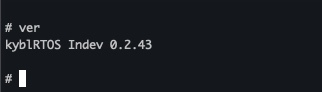

# kyblRTOS

RP2040 Real-Time Operating system built on top of freeRTOS Kernel
- **current version:** Indev 0.2.4

## Hardware
- Raspberry Pi Pico / W
- status and binary LED's
- I2C LCD
- buttons
- etc.. in the future

## Software
- serial over USB I/O
- serial console commands:
  * **bin**: convert decimal to binary and display it on LED's
  * **echo** prints the string back to the console
  * **other** (ver, help, exit)
 
## Description and Features

- WIP
